<div align="center">



<br/>

[](https://dvloper.com.co)
[](https://linkedin.com/in/devluism)
[](mailto:ing.luiszunigam@gmail.com)

</div>

---

### `~ whoami`

Senior Backend Engineer & **Technical Lead** with **10+ years** building scalable,
production-ready systems in **PHP (Laravel · Symfony)**, APIs, and cloud
architectures. Strong background in **SaaS platforms, fintech, multi-tenant
applications, asynchronous processing**, and external integrations.

Recently focused on **AI-driven features** — OpenAI integrations, automation
workflows, and practical **RAG-style** solutions. Comfortable owning systems
**end-to-end**: architecture → development → deployment → monitoring →
continuous improvement.

```php
<?php

final readonly class LuisManuel
{
    public function __construct(
        public string $title    = 'Senior Backend Engineer · Tech Lead',
        public string $company  = 'DVLOPER (Founder, 2016)',
        public int    $years    = 10,
        public array  $domains  = ['Fintech', 'SaaS', 'Multi-tenant', 'AI'],
        public array  $doctrine = ['SOLID', 'DDD', 'Event-driven', 'TDD'],
        public array  $langs    = ['Spanish (native)', 'English (professional)'],
    ) {}

    public function focus(): string
    {
        return 'Scalable backends · Cloud & AI integration · Team leadership';
    }
}
```

### `~ stack`

**Backend & Languages**


**Data & Async**


**Cloud & DevOps**


**AI**


### `~ experience --highlights`

| Where | Role | Impact |
|-------|------|--------|
| **Flusso Dynamic Group** | Sr. Technical Lead | Backend architecture for **fiat ⇄ stablecoin** fintech flows |
| **DVLOPER** | Founder / Sr. Engineer | Built a software company delivering **SaaS & enterprise** from concept to prod |
| **BookingAgent** | Sr. Engineer | Artist-search platform (Laravel 12 · PostgreSQL) + **OpenAI** enrichment |
| **Iam Studio** | Sr. Engineer | US real-estate backend · **AWS Lambda (Python)** async workflows |
| **VML** | Technical Lead | Led a **team of 4** · Laravel **6→11**, PHP **7.2→8.1** · **+30% perf** |
| **GrowPro** | SSR Backend | Symfony · CRM integrations (Zoho, HubSpot) · **+40% automation** |

### `~ what-i-bring`

- 🏗️ **Multi-tenant SaaS** & **fintech** architecture — isolation, scaling, reliability
- 🔄 **Event-driven systems** — queues (Redis · Horizon), jobs, webhooks, async processing
- 🤖 **AI integration** — OpenAI API, RAG basics, prompt engineering, automation workflows
- 👥 **Team leadership** — code review culture, standards, mentoring backend teams
- ☁️ **AWS-native** — S3, Lambda, RDS · plus GCP, Docker (Swarm), CI/CD pipelines
- ⚡ **Performance** — query optimization & production tuning (measured **+30%**)

### `~ github --stats`

<div align="center">


</div>

---

<div align="center">

<sub>🎓 Systems Engineering · 🌐 Spanish (native) · English (full professional) ·
📜 Laravel 12 · Docker/Swarm/Kubernetes · OOP in PHP</sub>

<br/><br/>

<sub>⭐️ Always open to collaborating on impactful projects and challenging problems.</sub>

<br/><br/>

<sub>The portrait above is my pixel-art avatar, turned into <b>colored ASCII</b> by a Python
script (<code>scripts/portrait.py</code>) and rendered into a terminal-style SVG
(<code>scripts/build_svg.py</code>). Concepts &gt; code — even for a README.</sub>

</div>
